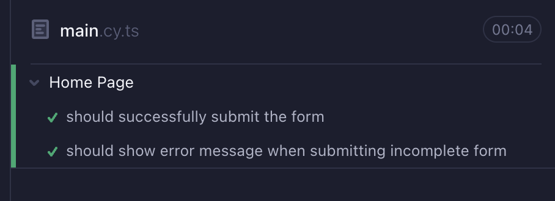
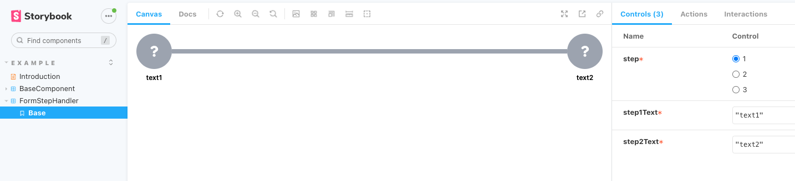
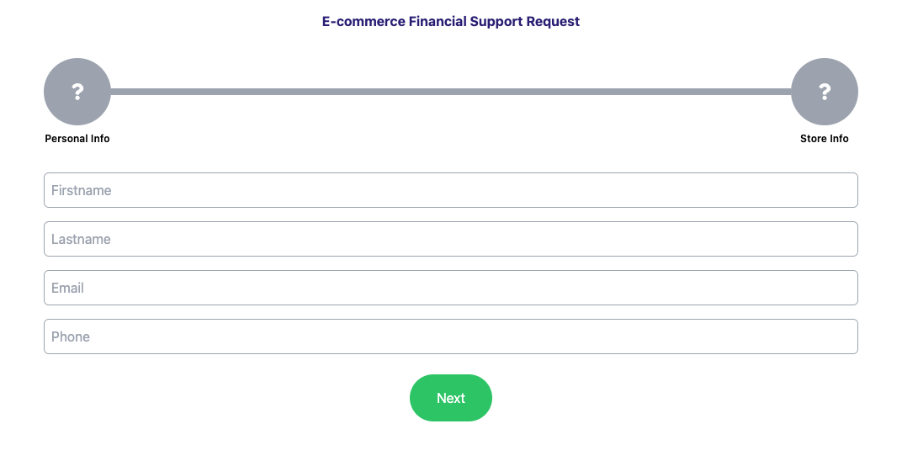
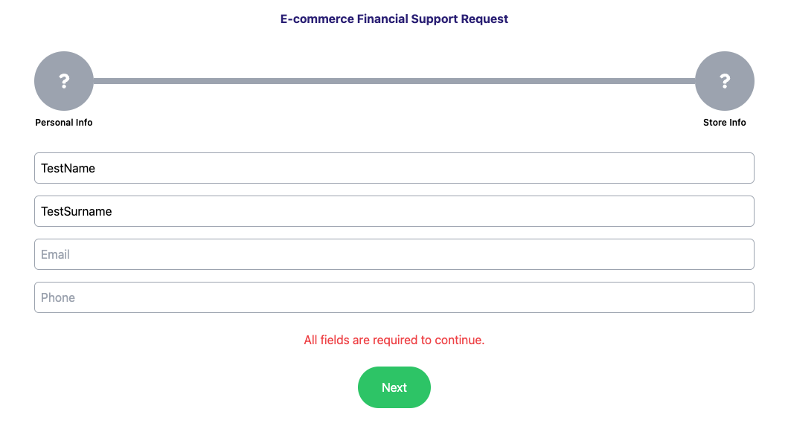
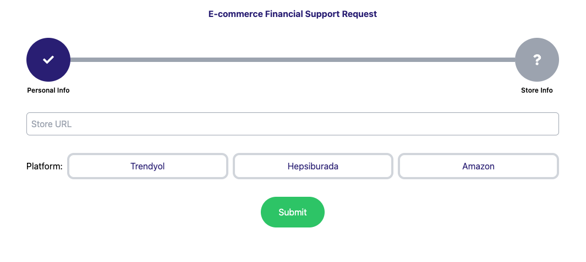
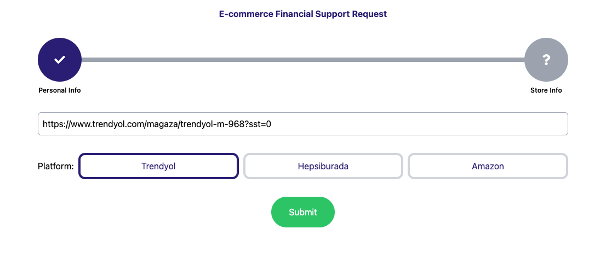
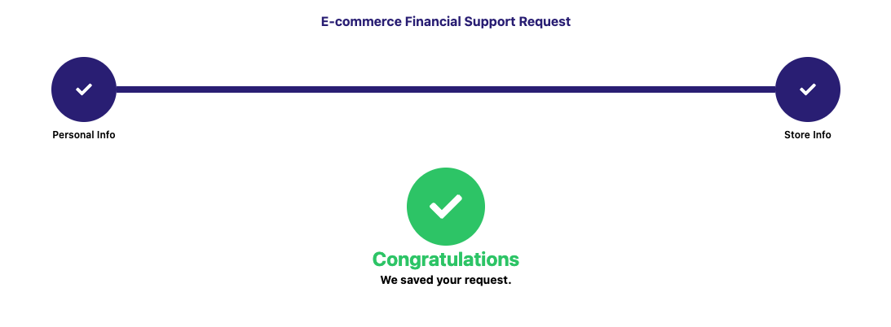
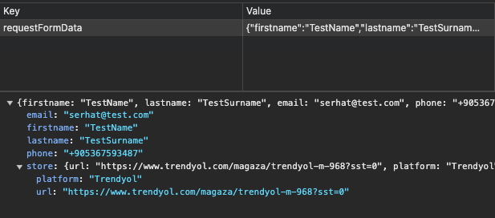

"E-commerce Support Request" project built on "https://github.com/SerhatPolat/large-scale-frontend-template"

<hr>

## Tech Stack:

Next.js, TypeScript, Storybook, Cypress, TailwindCSS & more

<hr>

## TODO

- [x] Build entire form flow with separating it to two steps
- [x] Build step handler component for better ux (w/ Storybook)
- [x] Write tests for entire flow including both happy path and negative path (w/ Cypress)
- [ ] Improve error handling & Write extra tests for that
- [ ] Build required backend side and connect it to the end of flow (as I commented on related part of code)

<hr>

## Automatized Cypress Tests:



```ts
describe("Home Page", () => {
  beforeEach(() => {
    cy.visit("http://localhost:3000");
  });

  it("should successfully submit the form", () => {
    // Step 1
    cy.get('input[placeholder="Firstname"]').type("Serhat");
    cy.get('input[placeholder="Lastname"]').type("Polat");
    cy.get('input[placeholder="Email"]').type("test@example.com");
    cy.get('input[placeholder="Phone"]').type("1234567890");
    cy.contains("Next").click();

    // Step 2
    cy.get('input[placeholder="Store URL"]').type("http://example.com/store");
    cy.contains("Trendyol").click();
    cy.contains("Submit").click();

    // Check for congrats message
    cy.contains("Congratulations");
    cy.contains("We saved your request.");
  });

  it("should show error message when submitting incomplete form", () => {
    cy.contains("Next").click();

    cy.contains("All fields are required to continue.");
  });
});
```

<hr>

## SCREENSHOTS









<hr>

```bash
yarn install

yarn dev

yarn build

yarn lint

yarn storybook

yarn cypress
```
